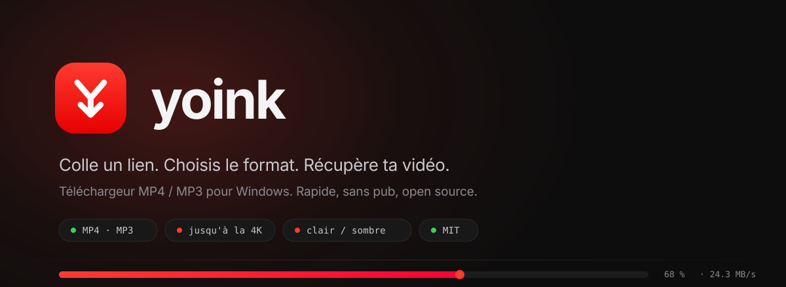
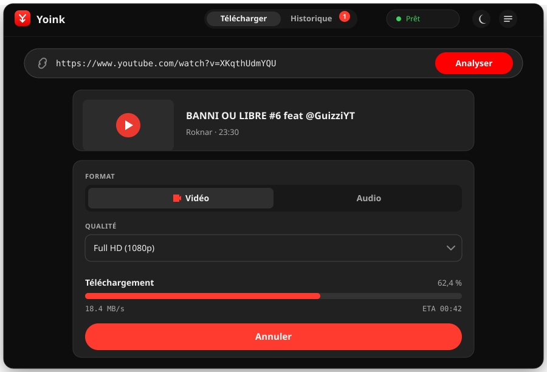
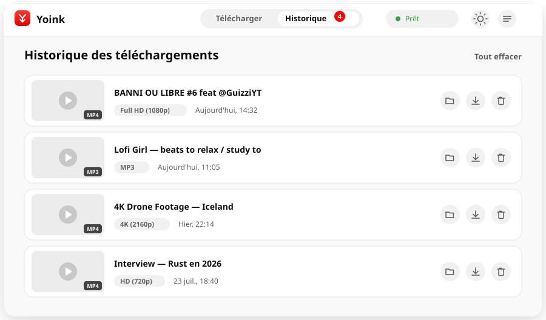
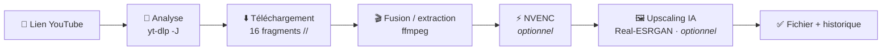

<div align="center">



<br>

**Colle un lien. Choisis le format. Récupère ta vidéo — MP4 ou MP3, en deux clics.**

Yoink est un téléchargeur de vidéos pour Windows. Il analyse un lien, te laisse choisir le
format, la qualité et le dossier, puis récupère le fichier avec `yt-dlp` et `ffmpeg` **embarqués
dans l'app**. Pas de pub, pas de compte, pas de site louche. Juste un outil propre.

[](LICENSE)
[](#prérequis)
[](https://tauri.app)
[](https://www.rust-lang.org)
[](#pourquoi)

[Aperçu](#aperçu) · [Fonctionnalités](#fonctionnalités) · [Comment ça marche](#comment-ça-marche) · [Installation](#installation) · [Développement](#développement)

</div>

> [!IMPORTANT]
> **L'interface est en français.** Le reste (code, commentaires) l'est aussi. Yoink est un projet
> perso, distribué tel quel — voir [Limites connues](#limites-connues) pour les angles morts.

---

## Pourquoi

Télécharger une vidéo YouTube, en 2026, c'est censé être trivial. En pratique c'est une jungle de
sites web couverts de fausses pubs, de « convertisseurs » qui plafonnent en 720p, d'exécutables
douteux et de limites de débit. Les bons outils existent — `yt-dlp` est excellent — mais ce sont
des lignes de commande.

Yoink, c'est `yt-dlp` + `ffmpeg` habillés d'une interface que tu n'as pas honte d'ouvrir :

| | |
|---|---|
| 🎯 **Simple, mais complet** | Colle, analyse, télécharge. Les réglages avancés (conteneur, ré-encodage GPU, upscaling) sont là si tu les veux, mais repliés derrière des choix par défaut sains. |
| ⚡ **Rapide** | Téléchargement multi-fragments (jusqu'à 16 en parallèle) pour contourner le bridage par flux. Une vidéo qui rampait à 120 Ko/s passe à plein débit. |
| 🎨 **Agréable à utiliser** | Thèmes clair et sombre, dropdowns et contrôles maison, historique intégré, barre de progression avec vitesse et ETA en direct. Zéro `cmd.exe`. |

C'est sous licence MIT et gratuit. Forke-le, démonte-le, réutilise ce qui te plaît.

---

## Aperçu

<div align="center">



<br><br>



</div>

> Ces images sont des rendus vectoriels fidèles de l'interface réelle (mêmes couleurs, mêmes
> composants) — pas des maquettes fantaisistes. Des captures d'écran photographiques sont sur la
> [roadmap](#roadmap).

---

## Fonctionnalités

**Téléchargement**
- Colle un lien, clique sur **Analyser** : titre, miniature, chaîne, durée et qualités disponibles
- **Multi-fragments** (`--concurrent-fragments 16`) + gros buffers réseau pour un débit maximal
- Barre de progression avec **pourcentage, vitesse et ETA** en temps réel
- **Annulation** propre à tout moment (le processus et toute son arborescence sont tués)
- Le dossier de sortie et le thème sont **mémorisés** d'une session à l'autre

**Formats & qualité**
- **Vidéo** : `MP4`, `MKV`, `WEBM`, `MOV` — de la HD à la 4K/8K selon la source
- **Audio** : `MP3`, `M4A`, `OPUS`, `FLAC`, `WAV`, avec trois niveaux de qualité
- **Sans perte par défaut** : la vidéo est simplement remuxée, sans ré-encodage
- **Ré-encodage GPU NVENC** en option (`H.264` / `HEVC`) pour changer de codec — cartes NVIDIA
- **Upscaling IA** optionnel via **Real-ESRGAN** (×2 / ×4) ou un mode rapide non-IA (×2, ffmpeg)

**Interface**
- Deux vues : **Télécharger** et **Historique**, dans une barre d'onglets
- **Thèmes clair / sombre** (palette rouge YouTube), basculables et persistés
- **Dropdowns custom** : les `<select>` natifs de Windows sont remplacés par des menus maison
- **Historique** local : miniature, format, qualité, date, avec « ouvrir le fichier » et « retélécharger »
- Un **journal** repliable pour voir la sortie brute de `yt-dlp` quand quelque chose cloche

**Sous le capot**
- Tout le lancement de processus est en **Rust** (pas de sidecar shell) : résolution fiable des
  chemins `ffmpeg` et streaming de progression robuste
- Les moteurs sont **embarqués comme ressources Tauri** — l'utilisateur final n'installe rien
- Aucune fenêtre console ne clignote (`CREATE_NO_WINDOW` sur chaque process)

---

## Comment ça marche



**Analyse.** `fetch_info` lance `yt-dlp -J` (dump JSON) et en extrait le titre, la miniature, la
chaîne, la durée et la liste dédupliquée des hauteurs vidéo disponibles, renvoyée au frontend pour
peupler le sélecteur de qualité.

**Téléchargement.** `start_download` construit la ligne de commande `yt-dlp` selon le mode. En
vidéo : un sélecteur de format `bv*[height<=H]+ba/b` puis `--merge-output-format` vers le conteneur
choisi. En audio : `-x --audio-format`. Dans les deux cas, l'accélération multi-fragments
(`-N 16`, `--buffer-size 16M`, `--http-chunk-size 10M`) est appliquée. La progression est streamée
via un `--progress-template` custom parsé ligne par ligne, et émise au frontend sur `dl:progress`.

**Ré-encodage GPU.** Si NVENC est activé, `--recode-video` + `--ppa VideoConvertor:-c:v <codec>
-preset p5 -cq 23` passe le flux dans l'encodeur matériel NVIDIA (`h264_nvenc` ou `hevc_nvenc`).

**Upscaling IA.** En post-traitement (vidéo uniquement, conteneur ≠ WEBM), `run_upscale` extrait
les images en PNG avec ffmpeg, les passe dans **Real-ESRGAN** (modèle `realesrgan-x4plus`, ×4), puis
réassemble le tout avec l'audio d'origine et un ré-encodage GPU. Le mode `×2` sur-échantillonne en
×4 puis redescend en lanczos pour un meilleur rendu. Le mode **rapide** saute l'IA et fait un simple
`scale=iw*2:ih*2:flags=lanczos`.

> [!NOTE]
> L'upscaling IA est **lent** (traitement image par image sur le GPU) et consomme temporairement
> beaucoup d'espace disque. Il nécessite un nom de fichier explicite (pour retrouver la sortie) et
> est ignoré pour le conteneur WEBM.

Le tout communique par **cinq commandes Tauri** (`check_engines`, `fetch_info`, `start_download`,
`cancel_download`, `reveal_path`) et **trois events** dans l'autre sens (`dl:progress`, `dl:log`,
`dl:done`).

---

## Installation

> [!WARNING]
> **Aucune release précompilée n'est publiée pour l'instant** (voir la [roadmap](#roadmap)). En
> attendant, compile depuis les sources — voir [Développement](#-développement). Le binaire n'est
> pas signé : Windows SmartScreen affichera un avertissement (« Informations complémentaires » →
> « Exécuter quand même »).

Une fois l'installateur `Yoink_x.y.z_x64-setup.exe` généré :

1. Lance-le — installation classique par utilisateur.
2. Ouvre Yoink, colle un lien, choisis ton format et ton dossier.
3. Clique sur **Télécharger**. C'est tout.

### Prérequis

- **Windows 10 ou 11.** L'app est Windows-only aujourd'hui : `explorer /select`, `taskkill`, et le
  ré-encodage NVENC sont spécifiques à la plateforme.
- Pour l'**upscaling IA** : un GPU compatible **Vulkan** (Real-ESRGAN tourne en ncnn/Vulkan, donc
  NVIDIA, AMD ou Intel). Pour le **ré-encodage NVENC** : un GPU **NVIDIA**.
- Aucune dépendance à installer : `yt-dlp` et `ffmpeg` sont embarqués dans l'app.

---

## Développement

### Outils

- [Node.js](https://nodejs.org) 18+
- [Rust](https://rustup.rs) + la toolchain MSVC (Visual Studio Build Tools, workload *Desktop
  development with C++*)
- WebView2 (déjà présent sur Windows 10/11)

### Mise en route

```powershell
npm install

# Télécharge les moteurs dans src-tauri/binaries :
#   yt-dlp.exe · ffmpeg.exe + ffprobe.exe · Real-ESRGAN (ncnn/Vulkan) + modèles
./scripts/setup-binaries.ps1

# Lance l'app en mode développement (hot-reload du front, recompilation du Rust)
npm run tauri dev
```

### Générer l'installateur

```powershell
npm run tauri build
```

L'installateur NSIS est produit dans `src-tauri/target/release/bundle/nsis/`.

### Mettre à jour les moteurs

YouTube change souvent ; si un téléchargement échoue, la première chose à faire est de remettre
`yt-dlp` à jour :

```powershell
./scripts/setup-binaries.ps1
```

Le script saute `ffmpeg` et Real-ESRGAN s'ils sont déjà présents. Supprime
`src-tauri/binaries/ffmpeg.exe` avant de relancer si tu veux aussi mettre ffmpeg à jour.

---

## Architecture

```
yoink/
├── index.html                     # structure de l'UI (une seule page)
├── src/
│   ├── main.js                    # toute la logique front : vues, thème, historique,
│   │                              #   dropdowns custom, events, appels aux commandes Tauri
│   └── styles.css                 # design system (variables clair/sombre, composants)
│
├── src-tauri/                     # back-end Rust
│   ├── src/
│   │   ├── lib.rs                 # tout le cœur : commandes, pipeline de téléchargement,
│   │   │                          #   NVENC, upscaling Real-ESRGAN, streaming de progression
│   │   └── main.rs                # point d'entrée
│   ├── binaries/                  # yt-dlp / ffmpeg / Real-ESRGAN (gitignoré, cf. script)
│   ├── icons/                     # icônes générées depuis app-icon.svg
│   ├── app-icon.svg               # logo source (régénère les icônes via `tauri icon`)
│   └── tauri.conf.json            # config Tauri, fenêtre, bundle, ressources
│
├── scripts/setup-binaries.ps1     # récupère les moteurs
└── assets/                        # bannière et visuels de ce README
```

**Stack :** [Tauri 2](https://tauri.app) + Rust côté back-end ; **JavaScript / HTML / CSS vanilla**
(bundlé par [Vite](https://vitejs.dev)) côté front — pas de framework, pas de dépendance runtime.

---

## Confidentialité

Yoink n'a **aucune télémétrie, aucun analytics, aucun compte**. Il ne parle qu'à deux choses : les
serveurs de la vidéo que tu télécharges (via `yt-dlp`, forcément) et GitHub, quand *toi* tu lances
`setup-binaries.ps1` pour récupérer les moteurs. L'historique est stocké **localement** dans le
webview, sur ta machine. La Content-Security-Policy de l'app est restreinte à `self` (plus les
images en `https:` pour les miniatures).

---

## Statut

Yoink est en **v0.1.0** — parfaitement utilisable au quotidien, mais pas encore 1.0.

### Limites connues

Autant être transparent sur les angles morts :

- **Pas de release précompilée** pour l'instant, et le binaire est **non signé** (avertissement
  SmartScreen attendu).
- **Windows uniquement.** macOS et Linux demanderaient de nouveaux back-ends pour l'ouverture de
  fichiers, l'annulation et le bundle.
- **Une seule vidéo à la fois** — pas de file d'attente ni de playlists (`--no-playlist` est forcé).
- **L'upscaling IA** exige un nom de fichier explicite et ignore le conteneur WEBM.
- Les options **NVENC** supposent un GPU **NVIDIA**.
- **Interface en français** uniquement, chaînes en dur dans le HTML/JS.

### Roadmap

- [ ] Releases signées sur GitHub Releases (avec l'installateur `.exe`)
- [ ] Support des playlists et file d'attente de téléchargements
- [ ] Captures d'écran réelles + GIF de démo dans ce README
- [ ] Sélection de langue / interface anglaise
- [ ] Support macOS et Linux

---

## FAQ

<details>
<summary><b>Pourquoi mon téléchargement est-il lent ?</b></summary><br>

C'est presque toujours YouTube qui bride le flux, pas l'app. Yoink télécharge déjà jusqu'à 16
fragments en parallèle pour contourner ça. Si c'est encore lent, c'est soit ta connexion, soit un
bridage temporaire de ton IP. Vérifie aussi que `yt-dlp` est à jour (`./scripts/setup-binaries.ps1`).
</details>

<details>
<summary><b>Faut-il installer yt-dlp ou ffmpeg séparément ?</b></summary><br>

Non. Ils sont embarqués dans l'app comme ressources Tauri. En développement, lance
`./scripts/setup-binaries.ps1` une fois pour les récupérer dans `src-tauri/binaries`.
</details>

<details>
<summary><b>NVENC ou upscaling : ça marche sans carte NVIDIA ?</b></summary><br>

Le **ré-encodage NVENC** nécessite un GPU NVIDIA. L'**upscaling IA** (Real-ESRGAN) tourne en
ncnn/Vulkan et fonctionne donc sur NVIDIA, AMD ou Intel. Le mode d'upscaling « rapide » (non-IA)
passe par ffmpeg et n'a besoin que du GPU pour le ré-encodage final.
</details>

<details>
<summary><b>Le « sans perte » veut dire quoi exactement ?</b></summary><br>

Par défaut, la vidéo et l'audio sont téléchargés puis simplement remuxés dans le conteneur choisi,
sans ré-encodage — donc sans perte de qualité. Le ré-encodage GPU (NVENC) n'est utile que si tu
veux <em>changer</em> de codec, et peut légèrement réduire la qualité.
</details>

<details>
<summary><b>Puis-je l'utiliser commercialement ?</b></summary><br>

Oui, licence MIT. Forke, rebrande, distribue — garde juste la notice de copyright. Respecte les
conditions d'utilisation des plateformes et le droit d'auteur du contenu que tu télécharges.
</details>

---

## Construit avec

[Tauri 2](https://tauri.app) · [Rust](https://www.rust-lang.org) ·
[yt-dlp](https://github.com/yt-dlp/yt-dlp) · [ffmpeg](https://ffmpeg.org) ·
[Real-ESRGAN](https://github.com/xinntao/Real-ESRGAN) · [Vite](https://vitejs.dev)

Merci immense aux mainteneurs de **yt-dlp** et de **ffmpeg** — sans eux, rien de tout ça n'existe.

## Licence

[MIT](LICENSE) © 2026 Mathew.

Gratuit, pour de vrai. Si tu construis quelque chose avec, ça me ferait plaisir de le savoir.

<div align="center">
<br>

<br><br>
<sub>Fait en France · Parce que télécharger une vidéo ne devrait pas demander un doctorat.</sub>
</div>
